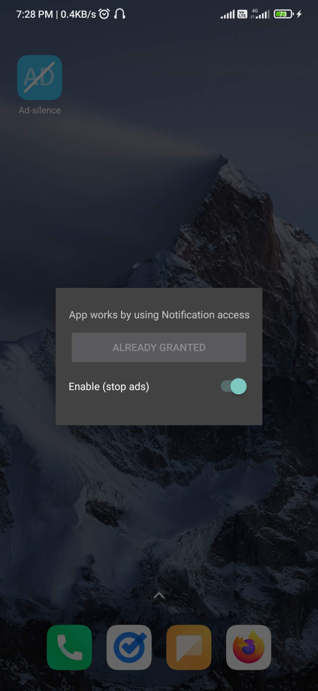

# Ad-silence

> Remove ads in Accuradio

## What apps are supported?

|    app    | support |
| :-------: | :-----: |
| Accuradio |   yes   |

Since this is built with `Accuradio` in mind, no other apps are supported for now, but Implementing other apps should be quite easy.

## Why

- Ad blocker for `Accuradio android` is not available.
- wanted a **lightweight** & **non bloat** app with size lessthan **_1mb_**
- wanted a minimal ui
  - below is the Total UI of the app.
  

     
  

## How this works

This is possible because of `NotificationListenerService` on `android`. Granted, the user gave permission to this setting.

- While music is playing, the following notification is present.

 

- I then parse the notification and stop it from playing.

## Track Project Status

- [Trello](https://trello.com/b/8XJDVbdo/ad-silence-android)

## Built with

- [Kotlin](https://kotlinlang.org/)
