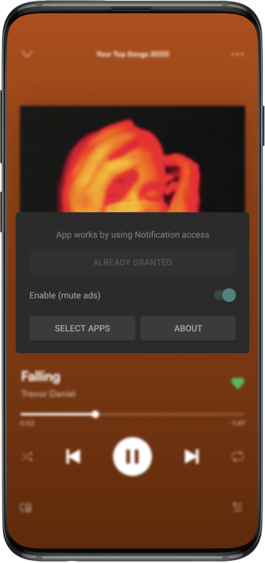
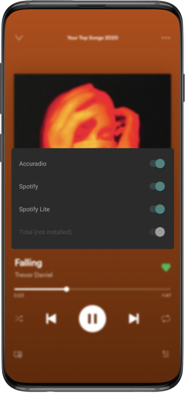
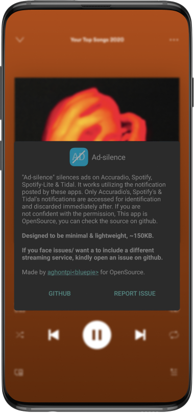

# Ad-silence

> Remove ads in Accuradio, Spotify, Tidal & Pandora.

### APP WAS TEMPORARILY UNAVAILABLE IN GOOGLE PLAYSTORE (Mon 17th Jan 2022 - Wed 19th Jan 2022) DUE TO POLICY VIOLATION, CHECK [THIS ISSUE](https://github.com/aghontpi/ad-silence/issues/19) FOR MORE DETAILS.

   
  
  
  

## Features

- Block ads on `Accuradio`, `Spotify` (full & lite versions), `Tidal` & `Pandora`.
- Minimal UI
- App size **less than 150KB**
- Configure which apps to remove ads in
- Open source
- No inapp purchases or ads

## Supported apps?

|     app      | support |
| :----------: | :-----: |
|  Accuradio   |   yes   |
|   Spotify    |   yes   |
| Spotify Lite |   yes   |
|    Tidal     |   yes   |
|   Pandora    |   yes   |

- If you want this to work on a different app/audio streaming service, [open an new issue](https://github.com/aghontpi/ad-silence/issues/new) mentioning its name.
- Since this is built with `Accuradio` in mind, ~~no other apps are supported for now, but Implementing other apps should be quite easy.~~
- `Spotify` is now supported.
- `Tidal` is now supported.
- `Spotify Lite` is now supported.
- `Pandora` is now supported.
- Easily extensible to other apps.

## Motivation

- Ad blocker for `Accuradio android` is not available.
- wanted a **lightweight** & **non bloat** app with size lessthan **_1mb_**
- wanted a minimal ui
  - below is the Total UI of the app.
  

     
     
     
  

## How this works

This is possible because of `NotificationListenerService` on `android`. Granted, the user gave permission to this setting.

- While music is playing, the following notification is present.

 

- I then parse the notification and stop it from playing.

## Track Project Status

- [Trello](https://trello.com/b/8XJDVbdo/ad-silence-android)

## Built with

- [Kotlin](https://kotlinlang.org/)

## Other

- featured in [top apps - youtube](https://youtu.be/hWfiQN4IUFM)
- featured in [top apps of december - youtube](https://www.youtube.com/watch?v=y-xopMyqfCU&t)
- featured in [app of the week](https://www.nextpit.com/apps-of-the-week-48-2021)
