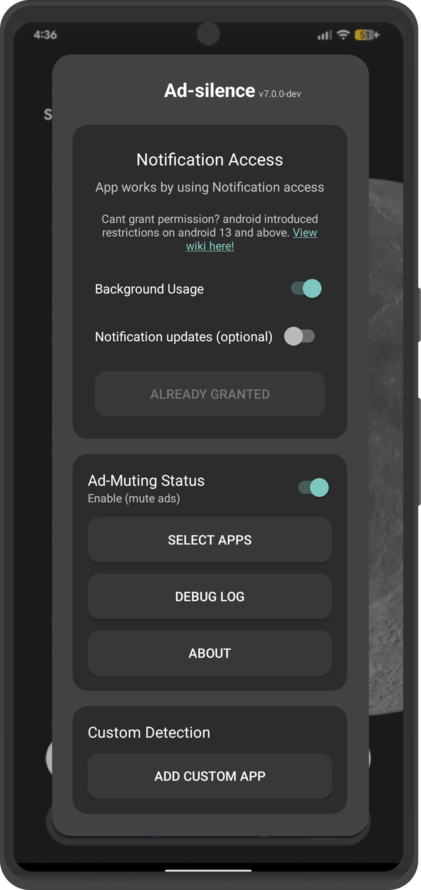
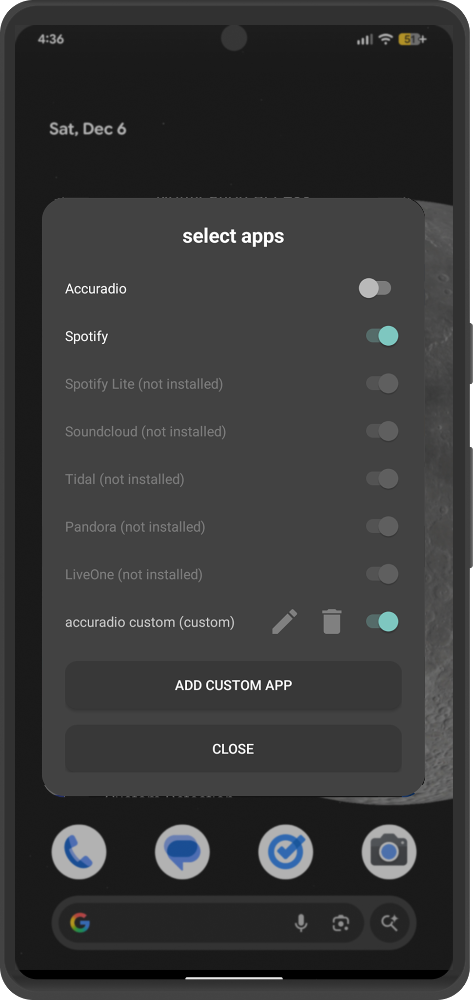
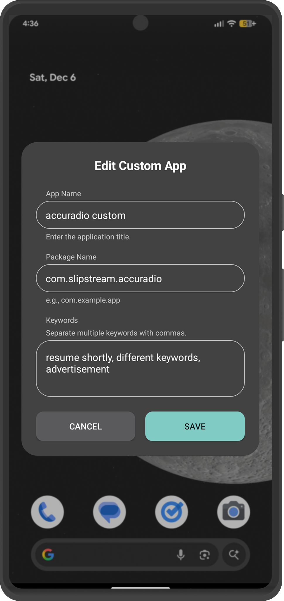
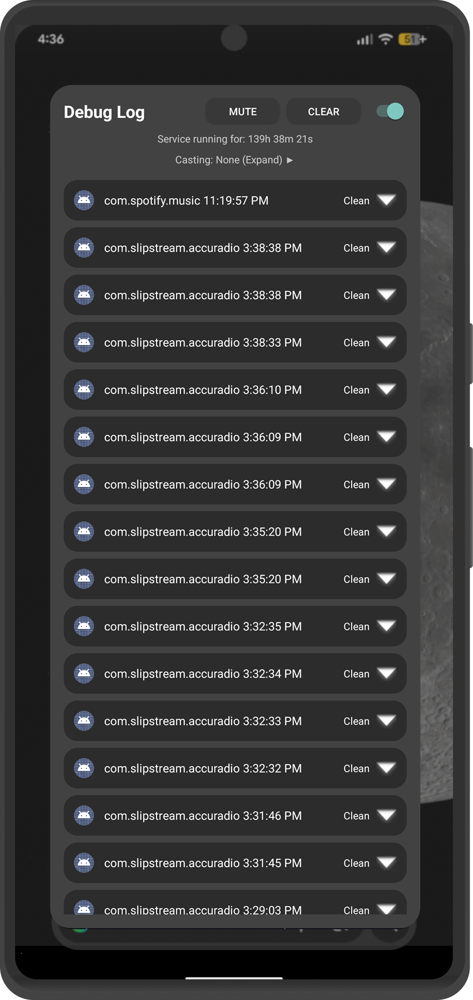
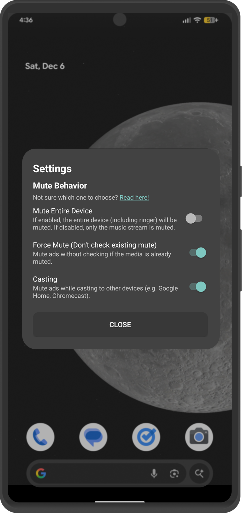
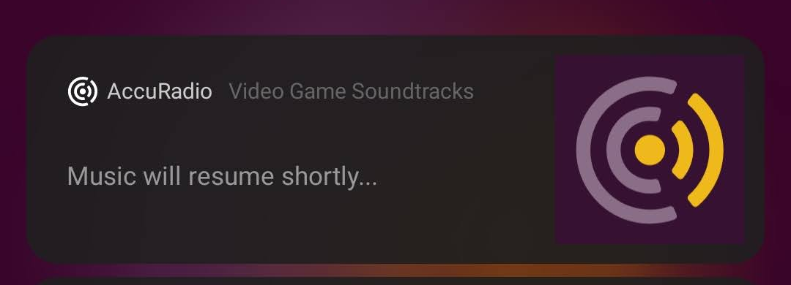

# Ad-silence

> Remove ads in Accuradio, Spotify, Tidal, Pandora or Any App.

   
  
  
  
  

 

## Features

- Block ads on `Accuradio`, `Spotify` (full & lite versions), `Tidal` & `Pandora` or **`Any app` with custom App Option**
- Minimal UI
- Debug log directly integrated in the app to help with easier debugging
- App size **less than 150KB**
- Configure which apps to remove ads in
- Open source
- No inapp purchases or ads

## Supported apps?

- **Custom Apps Support**: Ability to add, edit, and delete custom apps to be silenced.

> With the release of v0.7.0 and above, Ad-silence now supports custom apps with ability to add, edit and provide keywords specific to the app. 

|     app      | support |
|:------------:| :-----: |
|  Accuradio   |   yes   |
|   Spotify    |   yes   |
| Spotify Lite |   yes   |
|  Soundcloud  |   yes   |
|    Tidal     |   yes   |
|   Pandora    |   yes   |
| **Any app**  | yes |

## Custom Apps

You can now add any app to Ad-silence to mute its notifications.

1. Open Ad-silence.
2. Scroll down to "Custom Apps" section.
3. Click on "Add" button.
4. Enter the name, **Package Name** of the app (e.g., `com.example.radio`).
5. Enter **Keywords** to trigger muting only on specific notifications.
6. Click on "Save" button.

> **Note:**
> - The app will be muted only if the notification contains the keywords.
> - Will unmute the app if the notification does not contain the keywords.

> **Editing:**
> - click on "select apps" to view custom apps
> - click on the edit icon to edit it.
> - Enter the new name, **Package Name** of the app (e.g., `com.example.radio`).
> - Enter **Keywords** to trigger muting only on specific notifications.
> - Click on "Save" button.

> **Deleting:**
> - click on "select apps" to view custom apps
> - click on the delete icon to delete it.

## Debug Log

You have to enable the debug log in the app to see the logs.

- See the lifecycle events of the app in the app (incase if its not working, its easier to identify the issue).
- See all the logs of the service (notification listener) in the app .
- See all the notifications parsed by the service.
- Each debug logs is timestamped, gives out the parsing decision it made (like what it matched against and whether it matched or not).

You can keep the debug log enabled always, it will not affect the performance of the app, only the recent 100 logs are stored in memory.

## Motivation

- Ad blocker for `Accuradio android` is not available.
- wanted a **lightweight** & **non bloat** app with size lessthan **_200KB_**
- Runs forever in the background with absolute minimal resources
- wanted a minimal ui
  - below is the Total UI of the app.
  

     
     
     
     
     
  

## How this works

This is possible because of `NotificationListenerService` on `android`. Granted, the user gave permission to this setting.

- While music is playing, the following notification is present.

 

- I then parse the notification and stop it from playing.

## Track Project Status

- [Trello](https://trello.com/b/8XJDVbdo/ad-silence-android)

## Donation Links

- [https://www.buymeacoffee.com/aghontpi](https://www.buymeacoffee.com/aghontpi)
- [https://ko-fi.com/aghontpi](https://ko-fi.com/aghontpi)

## Built with

- [Kotlin](https://kotlinlang.org/)
