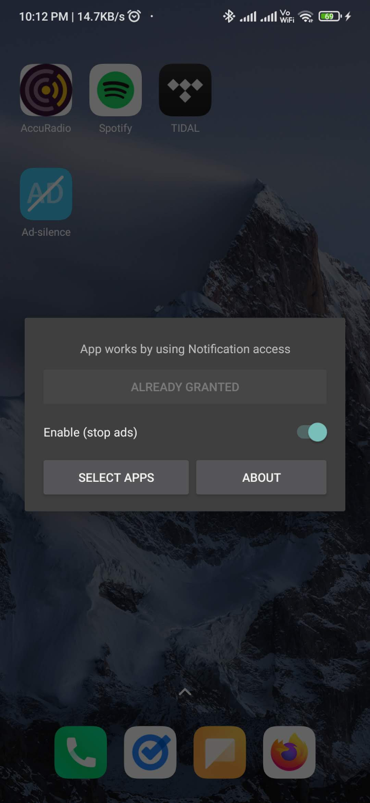
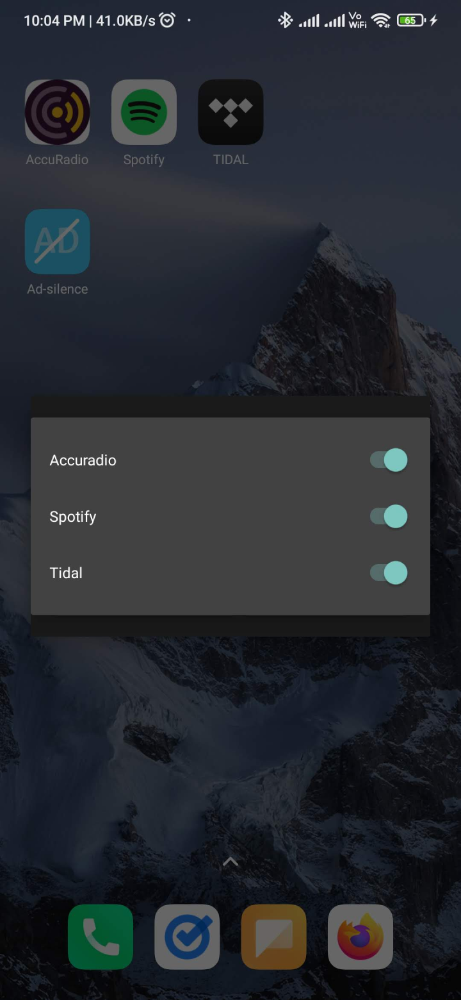

# Ad-silence

> Remove ads in Accuradio & Spotify

   
  
  

## Features

- Block ads on `Accuradio android` & `Spotify android`
- Minimal UI
- App size **less than 150KB**
- Configure which apps to remove ads in
- Open source
- No inapp purchases or ads

## Supported apps?

|    app    | support |
| :-------: | :-----: |
| Accuradio |   yes   |
|  Spotify  |   yes   |

- If you want this to work on a different app/audio streaming service, [open an new issue](https://github.com/aghontpi/ad-silence/issues/new) mentioning its name.
- Since this is built with `Accuradio` in mind, ~~no other apps are supported for now, but Implementing other apps should be quite easy.~~
- `Spotify` is now supported.
- Easily extensible to other apps.

## Motivation

- Ad blocker for `Accuradio android` is not available.
- wanted a **lightweight** & **non bloat** app with size lessthan **_1mb_**
- wanted a minimal ui
  - below is the Total UI of the app.
  

     
     
     
  

## How this works

This is possible because of `NotificationListenerService` on `android`. Granted, the user gave permission to this setting.

- While music is playing, the following notification is present.

 

- I then parse the notification and stop it from playing.

## Track Project Status

- [Trello](https://trello.com/b/8XJDVbdo/ad-silence-android)

## Built with

- [Kotlin](https://kotlinlang.org/)
